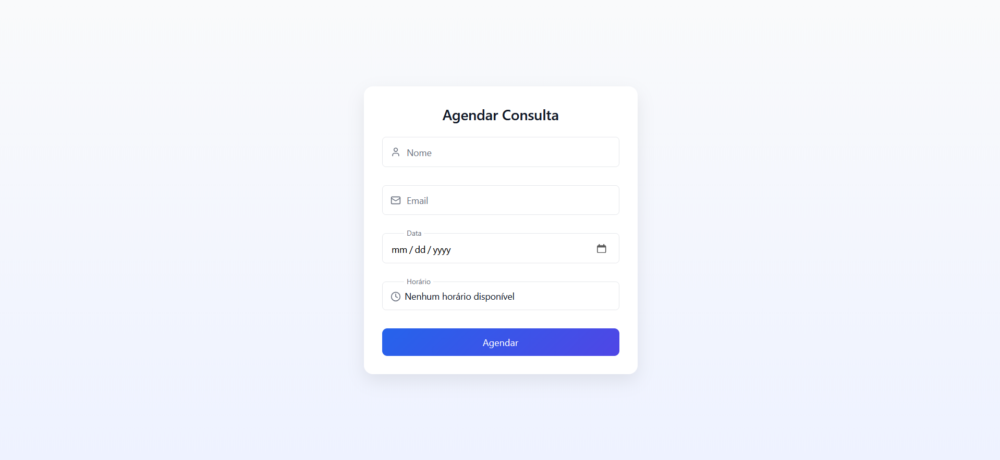
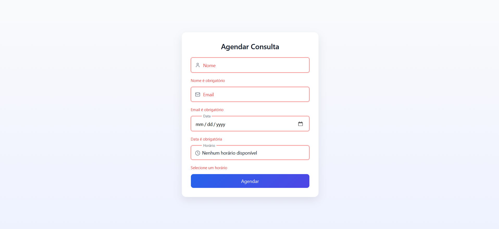
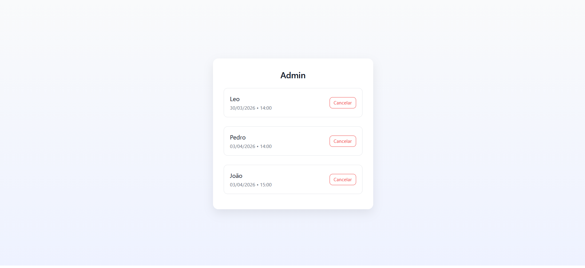
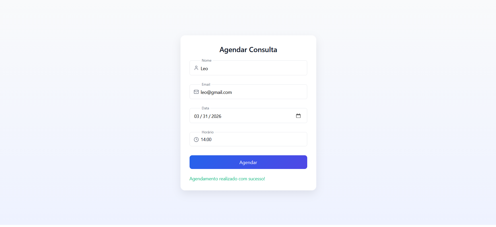

# 🗓️ Appointment Booking System

A fullstack web application for scheduling appointments with an admin panel to manage bookings.

## ✨ Features

- Create appointments with date and time selection
- Prevent double bookings (same time slot)
- Admin panel to view and delete bookings
- Clean and modern UI
- Form validation with visual feedback

---

## 🛠️ Tech Stack

### Frontend
- React
- Custom CSS (no frameworks)

### Backend
- Node.js
- Express

### Database
- PostgreSQL

---

## 📸 Preview

### Booking Page


### Validation


### Admin Panel


### Success State


---

## 🚀 Getting Started

### 1. Clone the repository

```bash
git clone https://github.com/CedoispirDB/booking-system.git
```

### 2. Setup Backend
```bash
cd backend
npm install
```

## Create a .env file:

```env
DATABASE_URL=your_database_url_here
```

## Run the server:

```bash
node src/index.js
```

### 3. Setup Frontend

```bash
cd frontend
npm install
npm run dev
```

### 🔑 Routes

## Frontend

- / → Booking page

- /admin → Admin panel

## Backend API

- GET /bookings → Get all bookings

- POST /book → Create booking

- DELETE /bookings/:id → Delete booking

📌 Notes

This project was built as a portfolio project and can be adapted for real-world use cases such as clinics, salons, or service-based businesses.

👨‍💻 Author

Developed by CedoispirDB 